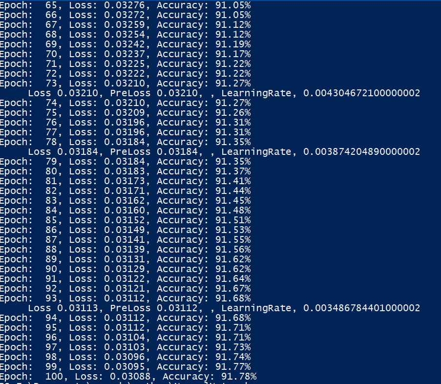
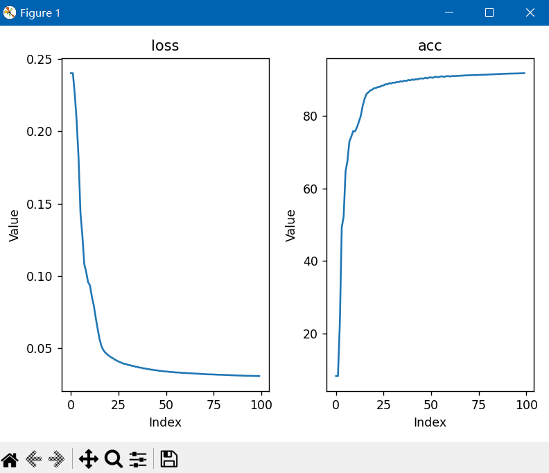
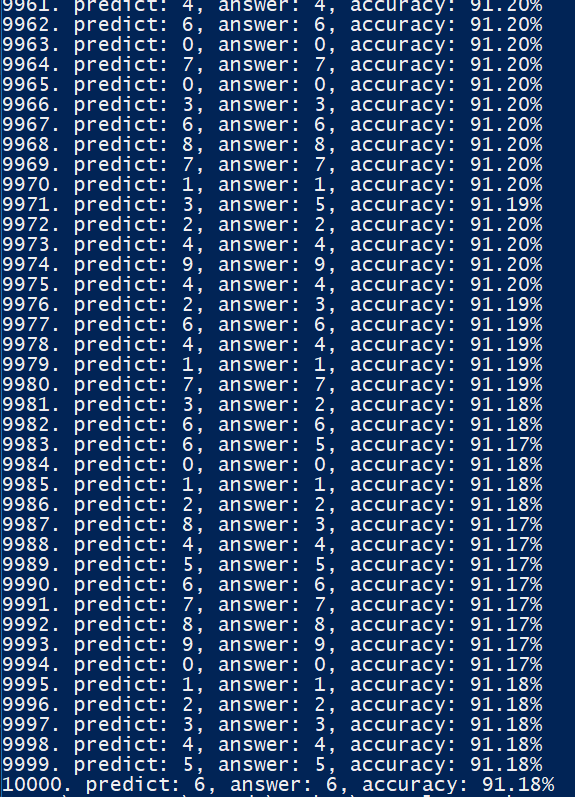

# for testing purpose
1. install tensorflow and numpy<br>
        ```
        pip install tensorflow
        ```<br>
        ```
        pip install numpy
        ```
2. Start train<br>
   You can choose start new model or use current trained model<br> ```models/test.txt```<br>
   If you want train new model, you can use following command:<br>
   ```
   python TrainMnist.py
   ```
   You can see progress on the console.<br><br>
   <br><br>
   The result is graphic is <br><br>
   <br><br>

3. Check the result<br>
   After training, you can check the result by using following command:<br>
   ```
   python LoadMnist.py
   ```
   Accuracy will be shown on the console.<br><br>
   